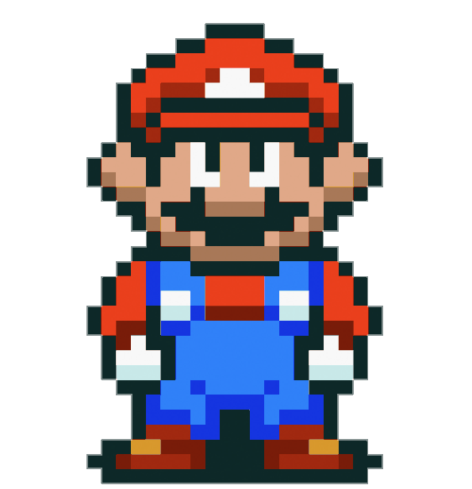

  

<h3>/ about me /</h3>

* 🚀 exploring modern frameworks, systems, and 3D graphics
* 👾 a developer crafting cool things on the web

 

<h3>/ current skills /</h3>

* **languages**  
  
  
  
  
  

* **frameworks &amp; libraries**  
  
  
  
  
  
  

* **tools &amp; databases**  
  
  

  

<h3> 🕊️ Support </h3>

